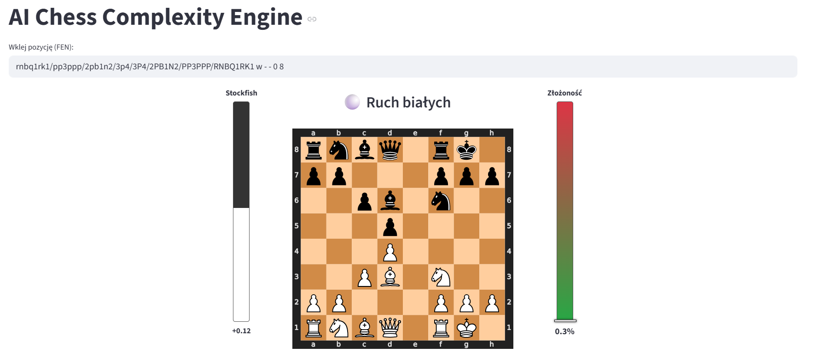
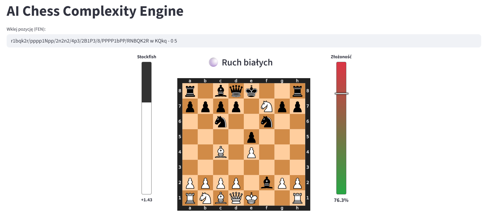

# AI Chess Complexity Engine

Traditional chess engines evaluate *who is winning*. This project evaluates **how easy it is to make a mistake**. 

The **AI Chess Complexity Engine** is a hybrid tool that estimates the cognitive difficulty of a chess position for a human player. It combines visual pattern recognition (Convolutional Neural Networks) with raw mathematical variance from traditional engines.

## The Concept: Human-Centric Evaluation
A position evaluated at `+0.0` by Stockfish can mean two things:
1. **A dead draw** where any legal move maintains equality (Low Complexity).
2. **A tactical minefield** where only one specific, difficult move prevents immediate mate (High Complexity).

This tool provides a **Complexity Score (0% - 100%)** to distinguish between the two, acting as a "stress meter" for the position.

## How It Works (The Hybrid Approach)
The final Complexity Score is calculated using two main pillars:

1. **Neural Intuition (The AI Base):**
   * A custom CNN model trained on **329451** chess positions. 
   * It analyzes the spatial relationship of pieces (e.g., pieces attacking the king) and outputs a base probability of a blunder occurring.
   * *It judges the visual "scariness" of the board.*

2. **Engine Variance (The Logic Boost):**
   * The app queries **Stockfish 16** using Multi-PV (evaluating the top 5 moves).
   * It calculates the stddev between these top moves.
   * If the best move is `0.0` and the second best is `-5.0`, the high variance triggers a penalty boost calculated via a Hyperbolic Tangent (tanh) function: `boost = tanh(σ / 1.5) * 0.4`.
   * *It mathematically proves if the position is a minefield.*

## Data Engineering & Model Training
The AI model wasn't downloaded pre-trained; it was built from scratch. The codebase for the data pipeline and model training is available in the repository.

1. **ETL Pipeline (`etl_multicore.py`):** Parsed raw PGN files of high-rated players, filtering out blitz games and extracting clean board states. Optimized for large datasets using multiprocessing.
2. **Data Labeling (`blunder_detector.py`):** Automated the labeling process by evaluating historical moves against Stockfish to flag high-variance blunders.
3. **Training (`notebooks/model_training.ipynb`):** The CNN model was trained in Google Colab using TensorFlow/Keras to predict blunder probabilities based purely on spatial piece configuration.

## Screenshots

| Low Complexity (Stable) | High Complexity (Tactical) |
| :---: | :---: |
|  |  |
| *French Defense Exchange Variation. Safe and solid.* | *Traxler Counterattack. One wrong move leads to disaster.* |

## Architecture & Reproduction Notes
This repository serves as a **portfolio showcase** of the end-to-end Machine Learning pipeline. 

Due to GitHub's storage constraints:
* The raw Lichess PGN datasets (100+ GB) are not included.
* The compiled Stockfish binary required for real-time variance calculation is excluded.

Therefore, this app is **not intended for local plug-and-play execution**. The provided code (`app.py`, `data_pipeline/`, and `notebooks/`) demonstrates the architecture, data processing techniques, and the mathematical logic behind the hybrid complexity engine.

## Tech Stack
* **Deep Learning:** TensorFlow / Keras (CNN Architecture)
* **Data Engineering:** NumPy, Pandas, Multiprocessing
* **Chess Logic:** `python-chess`
* **Frontend UI:** Streamlit
* **Engine Integration:** Stockfish (UCI Protocol)
